# python_dataviz การบ้านที่1
05/01/2020
## แนะนำตัว
นายภัทรวรรธน์ ใจเที่ยง รหัส 603021866-7

สาขาสารสนเทศสถิติ คณะวิทยาศาสตร์ มหาวิทยาลัยขอนแก่น

## ขอบเขตการนำเสนอ
 1. การ Install Python ลงเครื่อง 
 2. การใช้งาน Colab
 3. การใช้งาน github
 ______________________________________

## 1. การ Install Python ลงเครื่อง
#### ขั้นตอนที่1 - ก่อนอื่นเราต้องเช็คก่อนว่าเรามีโปรแกรม Anaconda หรือยัง โดยการ Search Box จะอยู่ตรงข้างๆ icon Windows จากนั้นให้หาว่าเครื่องเรามีโปรแกรม Anaconda Prompt หรือยัง ตามรูปดังนี้
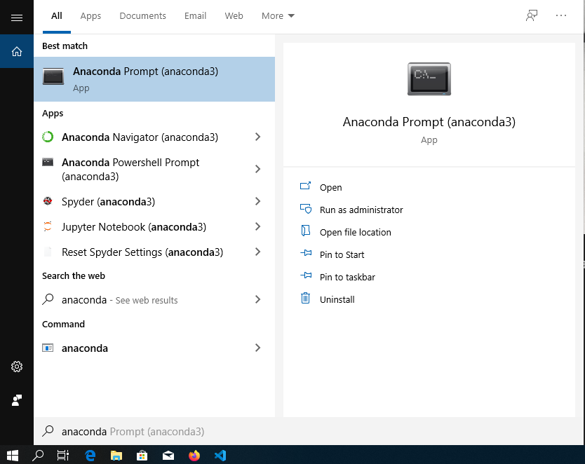
#### ขั้นตอนที่ 2 - หากยังไม่มี ให้เข้าไปที่เว็บนี้ [วิธีติดตั้ง Anaconda](https://medium.com/@saichonjaiyen/%E0%B8%81%E0%B8%B2%E0%B8%A3%E0%B8%95%E0%B8%B4%E0%B8%94%E0%B8%95%E0%B8%B1%E0%B9%89%E0%B8%87-anaconda-%E0%B8%9A%E0%B8%99-windows-4dbf02068792/) เพื่อทำการติดตั้ง Anaconda โดยจะต้อง Download ให้ตรงกับระบบปฏิบัติการ แนะนำให้ใช้ python 3.7 ตามรูปดังนี้
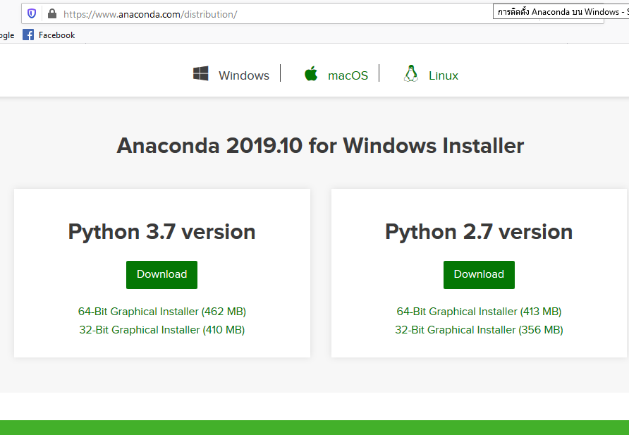 
#### ขั้นตอนที่ 3 - เมื่อ Download เสร็จสิ้น ให้เปิด Anaconda Prompt เหมือนในขั้นตอนที่ 1 ขึ้นมาจะพบหน้าตาดังรูปนี้
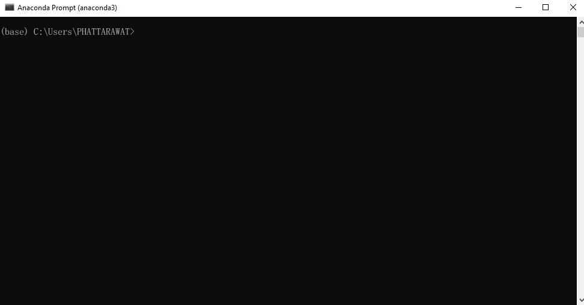
#### ขั้นตอนที่ 4 - เช็คดูว่าเครื่องมี Python แล้วหรือยัง? โดยการพิมพ์ว่า Python ดังรูปนี้ จะเห็นได้ว่าเราได้ทำการติดตั้ง Python 3.7.4 เรียบร้อยแล้ว

_______________________________________

## 2. การใช้งาน Colab
#### Google Colab เป็นโปรเจ็คที่พัฒนาโดยทีม Google Research ที่เปิดให้นักศึกษาและคนทั่วไปที่อยากเริ่มเขียนโค้ด Python ใช้งานได้ฟรีผ่าน Google Chrome โดยมีขั้นตอนการใช้งานดังนี้
#### ขั้นตอนที่ 1 - เข้าไปที่ [เว็บไซต์ colab ](https://colab.research.google.com) จะพบหน้าต่างดังนี้ โดย colab จะต้องลงชื่อเข้าใช้ด้วย mail ก่อนทุกครั้ง โดยจะใส่เป็น gmail หรือ kkumail ของมหาวิทยาลัยก็ได้
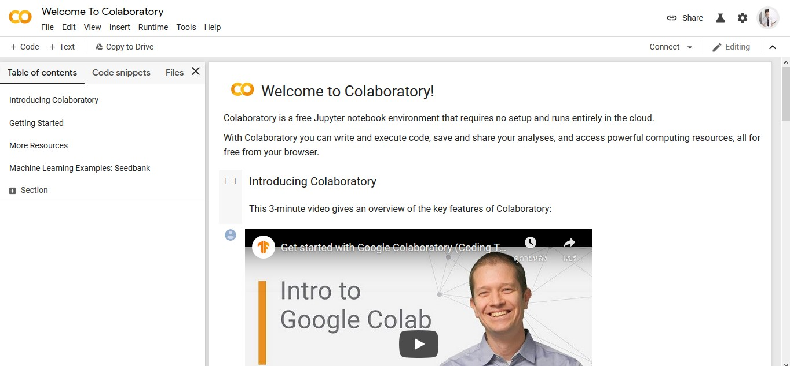
#### ขั้นตอนที่ 2 - เมื่อต้องการเขียนโค้ด Python ให้คลิกที่ File > New Python3 Notebook ดังรูปด้านล่างนี้
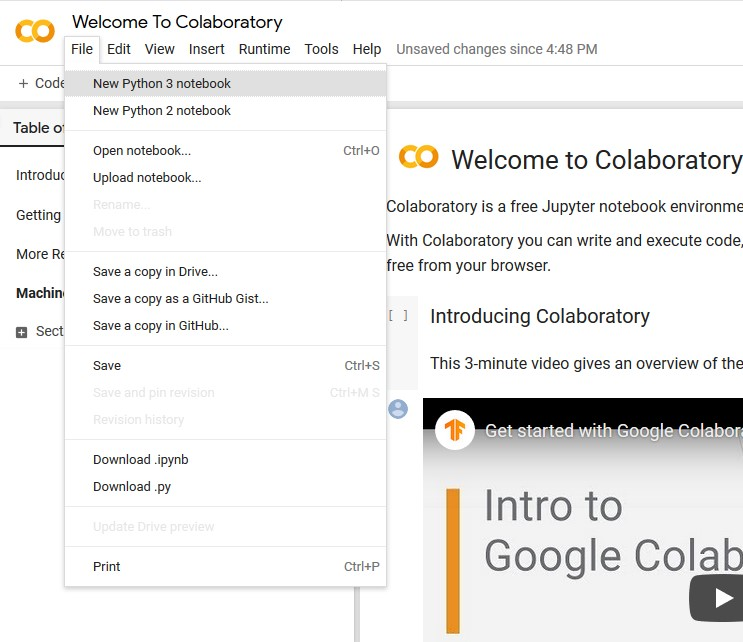
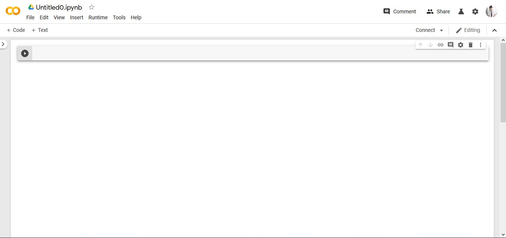
#### เพิ่มเติม ซึ่ง colab นี้สามารถตบแต่งหน้าต่างได้ตามที่เราต้องการได้ดังในรูปต่อไปนี้
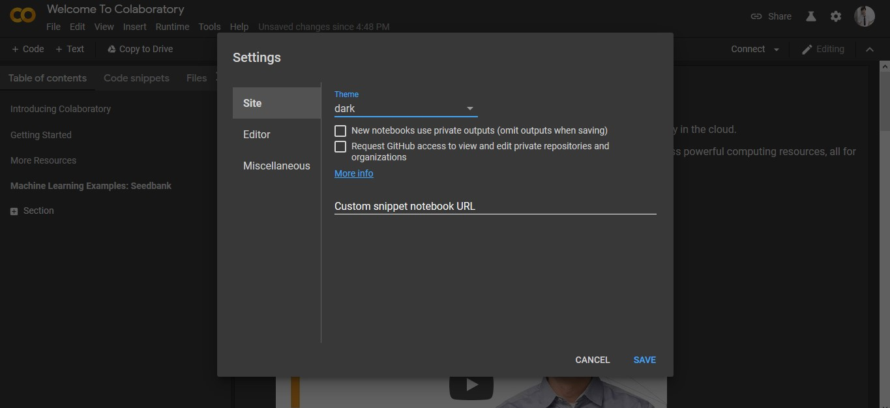
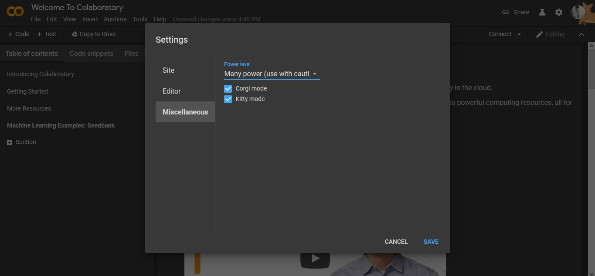
________________________________

## 3. การใช้งาน github
#### ใช้งาน Github ต้องทำอย่างไร??
#### ขั้นตอนที่ 1 - Register & Login จาก https://github.com/ โดยเลือกสมัคร “แบบ public(ฟรี)” จากนั้น Activate การสมัครผ่านทาง Email ที่เราสมัคร
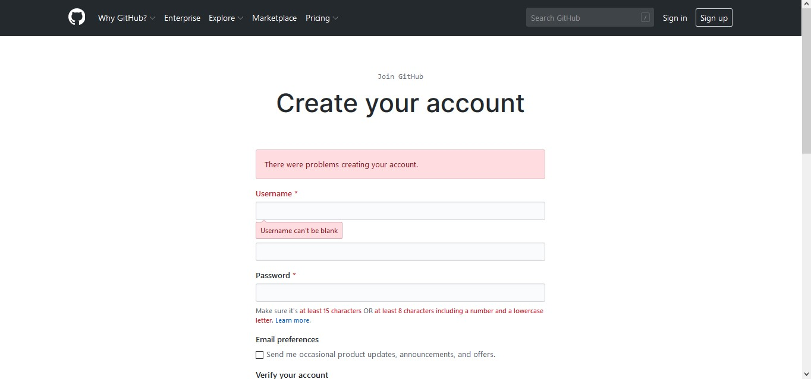
#### ขั้นตอนที่ 2 - เมื่อทำการสมัครเสร็จเรียบร้อย สามารถเริ่มต้นใช้งานได้เลย โดยการไปที่ New repository เพื่อทำกาสร้างที่เก็บดังรูปข้างล่างนี้
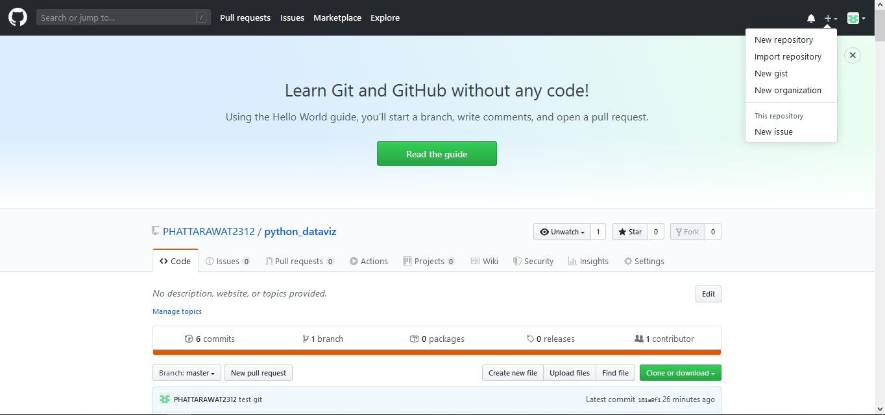
#### ขั้นตอนที่ 3 - ตั้งชื่อที่เก็บ แล้วทำการเลือกว่าให้เป็น Pubilc (คือทุกคนสามารถเข้ามาดูได้) หรือ Private (คือเมื่อต้องการให้เป็นส่วนตัว) ดังรูปข้างล่างนี้
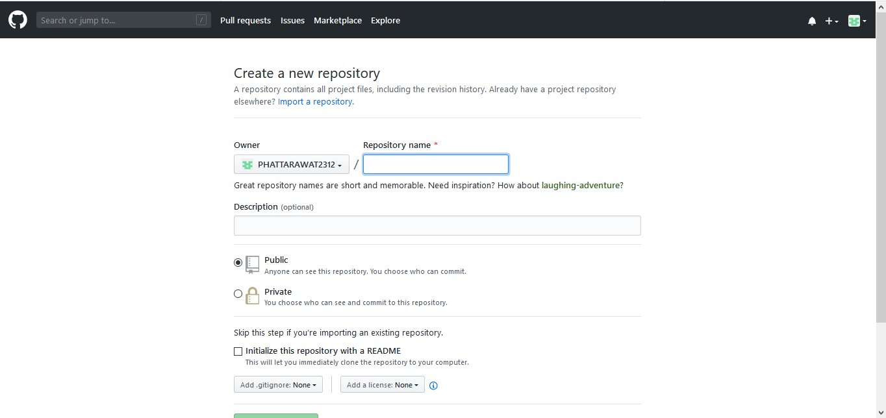
#### ใช้งาน github กับ Anaconda ??
#### ขั้นตอนที่ 1 - เข้า google พิมพ์ว่า anaconda install git แล้วทำการ copy code ในเว็บได้ดังนี้ 
'conda install -c anaconda git'
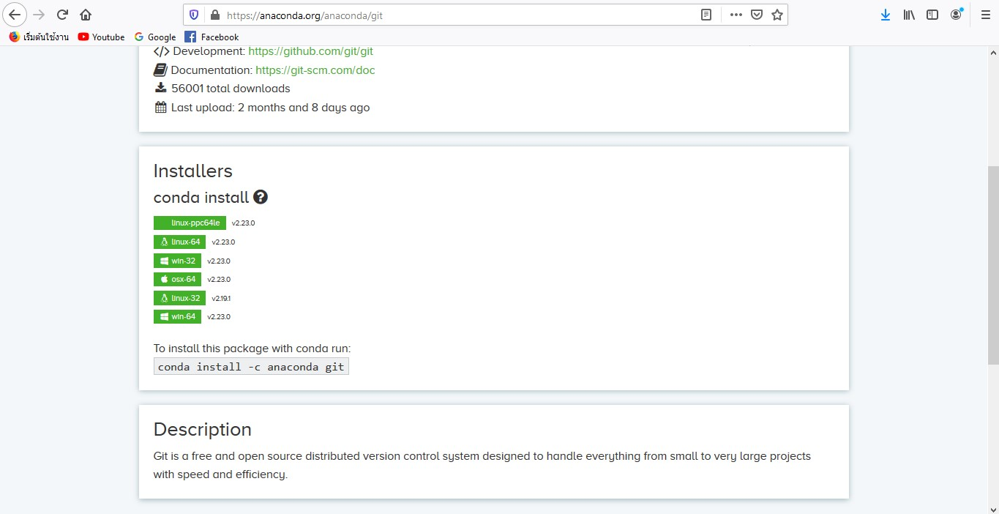
#### ขั้นตอนที่ 2 - เปิดโปรแกรม Anaconda Prompt ขึ้นมาเหมือนเดิมแล้ว paste ที่เรา copy code มาเมื่อกี้ จะได้ตามรูปข้างล่างนี้
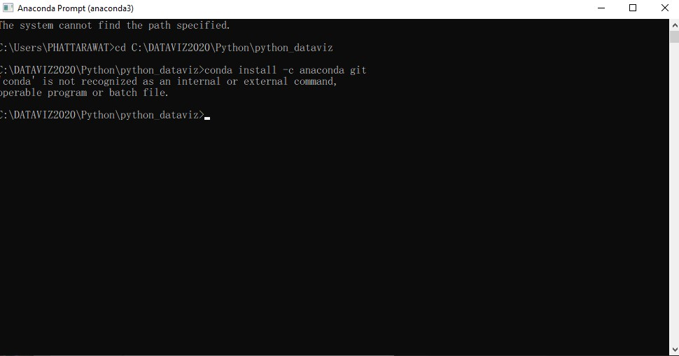
#### ใช้งาน visual Studio Code กับ github ??
#### ขั้นตอนที่ 1 - เข้า google พิมพ์ว่า Visual Studio Code แล้วทำการ Download ลงเครื่องได้เลย ตามรูปข้างล่างนี้
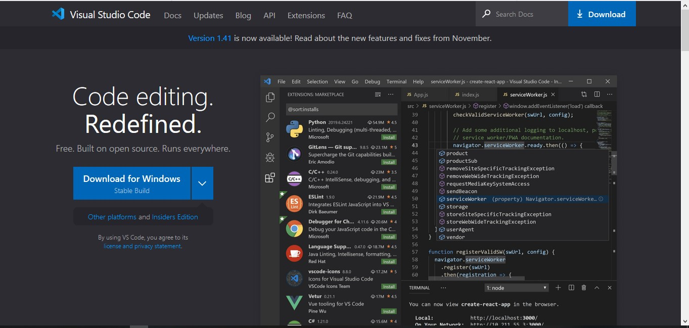
#### ขั้นตอนที่ 2 - เปิด Visual Studio Code ขึ้นมา
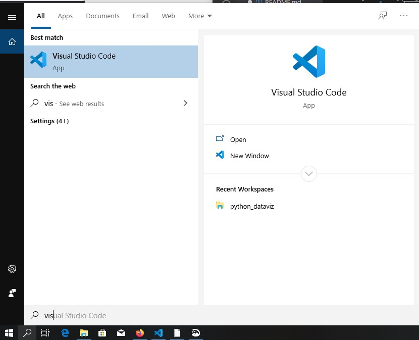
#### ขั้นตอนที่ 3 - เชื่อมโปรเจค(New repository) ที่เราสร้างขึ้นมา โดยเปิด github ขึ้นมาแล้วทำการคลิกที่ Clone or download ตามรูปข้างล่างนี้ แล้วทำการ copy code มาตามรูปที่2ข้างล่างนี้
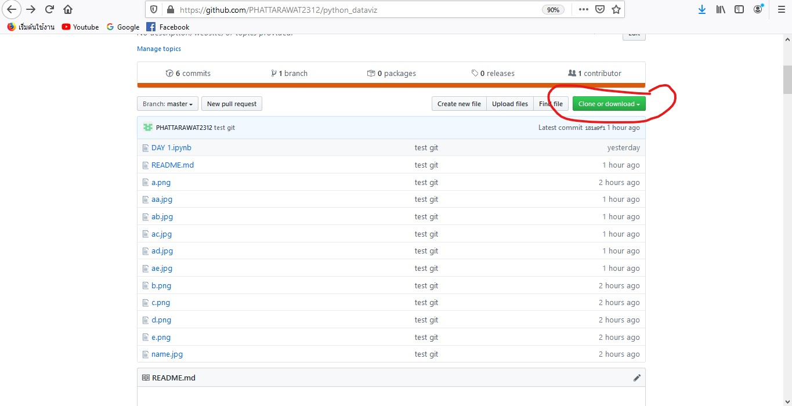
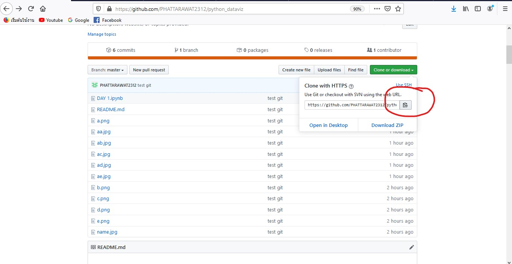
#### ขั้นตอนที่ 4 - เปิด Anaconda Prompt ขึ้นแล้วมาพิมพ์คำสั่งเชื่อมโปรเจค git clone วางที่เราcopyมา จะได้ดังรูปข้างล่างนี้ 
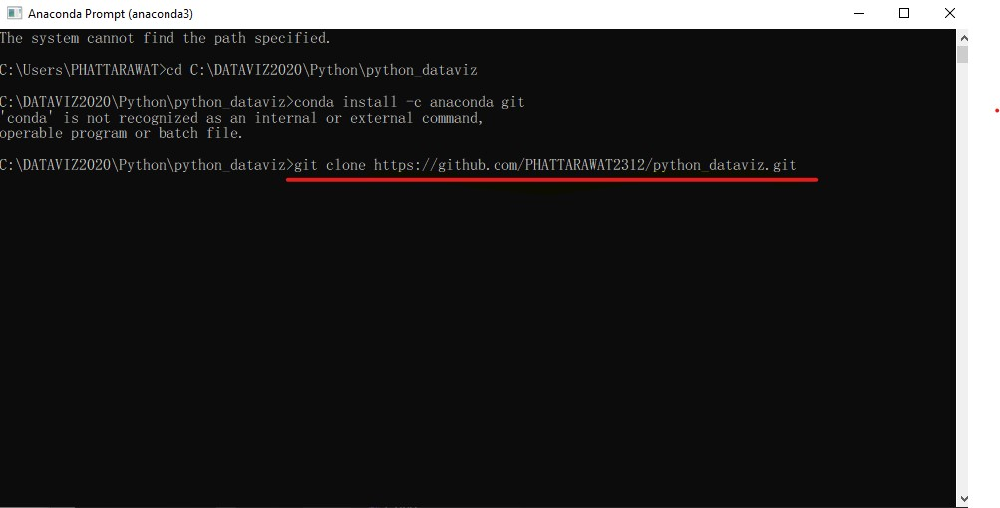
#### ขั้นตอนที่ 5 - พิมพ์คำสั่ง dir เพื่อตรวจสอบดูว่ามีไฟล์อะไรบ้างที่เชื่อมแล้ว
#### ขั้นตอนที่ 6 - พิมพ์คำสั่ง git status เพื่อดูว่ามีไฟล์ไหนยังไม่เชื่อมกับ internet บ้าง
#### ขั้นตอนที่ 7 - เมื่อพบว่ายังมีไฟล์ยังไม่เข้าไปใน git เราจะใช้คำสั่ง git add "ชื่อไฟล์นั้น"
#### ขั้นตอนที่ 8 พิมพ์คำสั่ง git commit -m "test git" เพื่อบอกว่าเรากำลังทำอะไรอยู่
#### ขั้นตอนที่ 9 เป็นการเข้าใช้งานโดยการพิมพ์คำสั่ง 'git config --global user.email"อีเมลที่เราสมัคร" และ git config --global user.name"Nameที่เราตั้งในgithub"
#### ขั้นตอนที่ 10 ทำการ พิมพ์คำสั่ง git commit -m "test git" อีกครั้ง
#### ขั้นตอนที่ 11 พิมพ์คำสั่ง git push เพื่ออัพงานเข้า github 